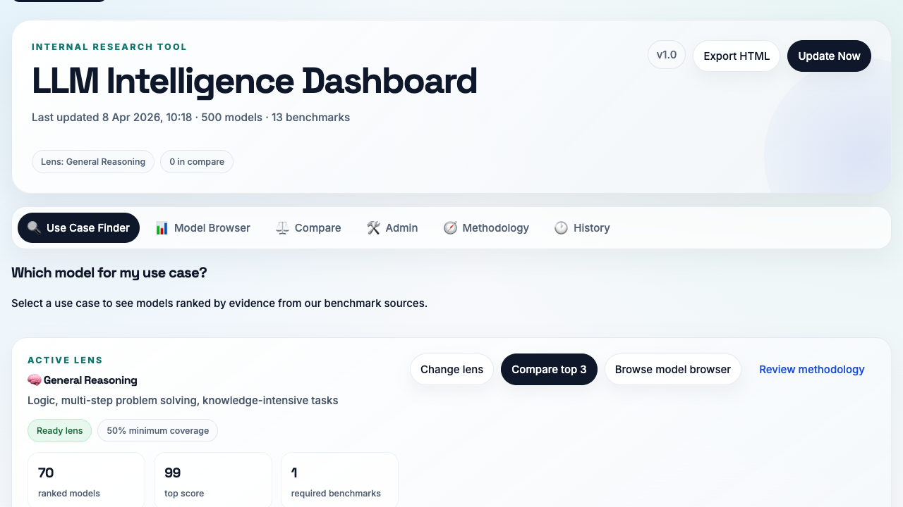

# LLM Benchmarking

LLM Benchmarking is a local model intelligence workspace for comparing AI models across public benchmarks, curating provider and family metadata, governing approvals by use case and inference region, and exporting portable offline snapshots.



## License

MIT. See [LICENSE](LICENSE).

## What The App Does

- Ranks models by use-case lens such as general reasoning, coding, customer support, bulk processing, and governed enterprise rollout.
- Browses the catalog in both family and exact-model views.
- Tracks benchmark coverage, ranking eligibility, and model age/freshness.
- Enriches models with OpenRouter market signals, Hugging Face model-card metadata, and hyperscaler inference-location coverage.
- Supports Admin workflows for:
  - provider-origin curation
  - use-case approvals
  - recommendation states
  - inference-provider and inference-region approvals
  - bulk family approval actions
  - manual internal benchmark inputs
  - family / duplicate model curation
- Shows update history, source-run detail, and post-update audit output.
- Exports a single-file portable HTML snapshot with offline search, filters, sorting, compare, methodology, and history.

## Stack

- FastAPI backend in [backend/main.py](backend/main.py)
- React + Vite frontend in [frontend/src/App.jsx](frontend/src/App.jsx)
- SQLite database at `data/db.sqlite`
- SQLAlchemy Core schema in [backend/database.py](backend/database.py)
- Source adapters in [backend/sources](backend/sources)

## Quick Start

```bash
git clone https://github.com/BoweyLou/llm-benchmarking.git
cd llm-benchmarking

python -m venv .venv
source .venv/bin/activate
pip install -r backend/requirements.txt

cd frontend
npm install
cd ..

python -m backend bootstrap
python -m backend update
```

What those commands do:

- `python -m backend bootstrap`
  Creates the schema, seeds reference data, applies repo-backed provider-origin and model-curation baselines, and refreshes lightweight metadata such as OpenRouter catalog and market signals.
- `python -m backend update`
  Runs the benchmark ingestion/update pipeline and writes update history + audit results.

If you want the older one-shot bootstrap-and-ingest flow, it still exists:

```bash
python -m backend.bootstrap_db
```

## Run Locally

Backend:

```bash
source .venv/bin/activate
uvicorn backend.main:app --reload --port 8000
```

Frontend:

```bash
cd frontend
npm run dev
```

Default local URLs:

- Frontend: `http://127.0.0.1:5173`
- Backend API: `http://127.0.0.1:8000`

The backend bootstraps the schema on startup if needed.

## Main UI Areas

- `Use Case Finder`
  Lens-aware shortlist with ranked cards and benchmark evidence.
- `Model Browser`
  Search, filter, sort, compare, and inspect models in family or exact view.
- `Compare`
  Side-by-side benchmark and metadata comparison.
- `Admin`
  Governance, curation, and manual metadata editing.
- `Methodology`
  Lens definitions, benchmark library, and evidence weighting.
- `History`
  Update logs, source-run detail, audit output, and market snapshots.

## Current Data Sources

Benchmark adapters:

- Artificial Analysis
- Chatbot Arena
- AILuminate
- GPQA Diamond
- IFEval
- MMMU
- SWE-bench Verified
- Terminal-Bench
- FaithJudge
- Vectara Hallucination

Metadata and catalog enrichments:

- OpenRouter models and market/ranking signals
- Hugging Face model-card metadata
- Hyperscaler inference catalogs for:
  - AWS Bedrock
  - Azure AI Foundry
  - Google Vertex AI

## Admin / Governance Model

The current approval model is more than a simple global allow-list:

- approval is stored per `model x use case`
- recommendation is stored separately from approval
- inference-route approval can be stored per `model x use case x provider x location`
- family bulk approval actions write through to exact models rather than using hidden inheritance
- new models discovered in updates can be surfaced for review in Admin
- provider-origin and model-curation state can be edited in Admin and exported back to repo-backed baselines

## Portable HTML Export

The `Export HTML` action generates a single-file portable snapshot.

What it includes:

- offline search
- provider / inference / recommendation filters
- sorting
- compare
- family and individual-model browsing
- methodology
- history

What it intentionally excludes:

- Admin editing
- live updates
- backend API calls

The exported HTML is designed to be moved to another machine and opened locally as a self-contained document.

## Data Durability

SQLite is the runtime store, but some important manual metadata is also kept in tracked repo baselines so it does not get lost on rebuilds:

- provider origin baseline: [backend/provider_origin_baseline.json](backend/provider_origin_baseline.json)
- model curation baseline: [backend/model_curation_baseline.json](backend/model_curation_baseline.json)

Those baselines are applied during bootstrap and can be re-exported from the live DB.

## CLI Reference

The supported command surface is in [backend/cli.py](backend/cli.py).

Common commands:

```bash
python -m backend bootstrap
python -m backend update
python -m backend update --benchmarks terminal_bench swebench_verified
python -m backend inference-sync
python -m backend inference-sync --destinations aws-bedrock azure-ai-foundry
python -m backend model-card-sync
python -m backend provider-origin-export
python -m backend model-curation-export
```

Notes:

- `inference-sync` supports destination subsets.
- `model-card-sync` backfills Hugging Face-backed model-card metadata such as license, docs URL, repo URL, paper URL, languages, capabilities, intended use, and limitations.
- `provider-origin-export` and `model-curation-export` push live curation back into the tracked baseline JSON files.

## Contributor Workflow

Backend checks:

```bash
python -m py_compile backend/*.py backend/sources/*.py
python -m unittest backend.test_rankings
```

Frontend checks:

```bash
cd frontend
npm run build
```

Inference sync checks:

```bash
./scripts/test_inference_suite.sh
./scripts/test_inference_sync_smoke.sh
```

The smoke script accepts a subset, for example:

```bash
./scripts/test_inference_sync_smoke.sh aws-bedrock
./scripts/test_inference_sync_smoke.sh azure-ai-foundry google-vertex-ai
```

`aws-bedrock` can run in pricing-only mode without credentials. `azure-ai-foundry` has a public-pricing-only fallback without credentials. `google-vertex-ai` has a published-endpoints-only fallback without credentials.

## API Surface

The core API is in [backend/main.py](backend/main.py). High-level groups:

- catalog: `/api/models`, `/api/providers`, `/api/benchmarks`, `/api/use-cases`
- rankings: `/api/rankings`
- admin edits:
  - provider updates
  - model/use-case approvals
  - inference-route approvals
  - manual benchmark scores
  - model identity and duplicate curation
- update operations:
  - `/api/update`
  - `/api/update/status/{log_id}`
  - `/api/update/history`
  - `/api/update/history/{log_id}/sources`
  - `/api/update/source-runs/{source_run_id}/raw-records`
  - `/api/update/audit/{log_id}`
- market snapshots: `/api/market-snapshots`

## Current State Summary

Today this repo is not just a benchmark leaderboard. It is a local operating console for:

- benchmark-backed model ranking
- model catalog curation
- governance approvals and recommendations
- inference-region review
- provider-origin tracking
- update monitoring and audit
- portable offline sharing

## Key Docs

- [AGENT_BUILD_SPEC.md](AGENT_BUILD_SPEC.md)
- [ai_benchmark_report_2026.md](ai_benchmark_report_2026.md)
- [UPDATE_GUIDE.md](UPDATE_GUIDE.md)
