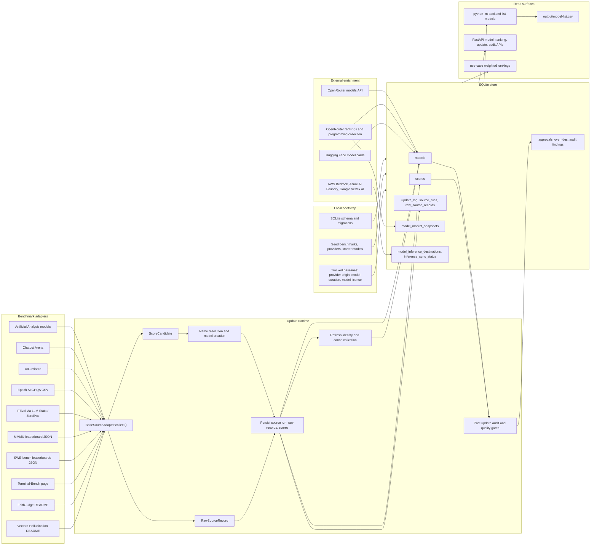

# Data Ingest Source Map

This map documents the current ingest pipeline and the nearest data wins to
consider before changing implementation. It is based on the source adapters and
update code in this checkout, plus a narrow source check on public benchmark
projects on 2026-07-01.

## Current Flow

## Update Sequence

1. `python -m backend bootstrap` is local-only. It creates or repairs the
   SQLite schema, seeds benchmark/provider/model reference rows, applies tracked
   baselines, recovers interrupted updates, and refreshes local identity state.
2. `python -m backend update` selects adapters, creates an `update_log`, and
   runs each adapter through `fetch_raw()` and `normalize()`.
3. Each adapter produces raw source records and normalized score candidates.
   The update engine resolves names, creates missing models, upserts the best
   score per model and benchmark, and stores raw records for auditability.
4. Post-source phases refresh identity/canonical model fields, reapply provider
   origin baselines, pull OpenRouter model metadata, refresh Hugging Face model
   cards and licenses, collect optional OpenRouter market signals, and run the
   post-update audit.
5. `python -m backend inference-sync` is a separate sync for hyperscaler
   inference destinations. It writes availability, region, deployment-mode, and
   pricing evidence to the inference catalog tables.

## Current Source Inventory

| Source | Current adapter or phase | Provides now | Current limitations | Low-hanging data already nearby |
| --- | --- | --- | --- | --- |
| Artificial Analysis models | `ArtificialAnalysisAdapter` | `aa_intelligence`, `aa_speed`, `aa_cost` from model leaderboard payloads or table fallback. Also sees creator/family metadata in raw rows. | Only three AA model metrics become scores. Other AA evaluation pages are not ingested. | Add adapters for AA evaluation pages such as LiveCodeBench, IFBench, Humanity's Last Exam, MMLU-Pro, MMMU-Pro, long-context reasoning, Terminal-Bench Hard, ITBench-AA, and the AA Openness Index. The AA LiveCodeBench page also exposes token usage and evaluation cost panels. |
| Chatbot Arena | `ChatbotArenaAdapter` | Arena ELO, rank bands, votes, organization, model URL, license, price, and context metadata. | Only the ELO becomes a score; metadata stays in raw/source notes. | Promote organization, license, input/output price, context length, and model URL into model metadata when OpenRouter/HF is absent or stale. |
| AILuminate | `AILuminateAdapter` | MLCommons grade converted to 0-100, locale, benchmark version, system class, risk ordinal, detail URL. | Picks one best row per model, favoring higher score, AI Systems, then `en_us`. Coarse public grade only. | Preserve per-locale and per-system-class results as separate evidence rows or sub-benchmarks; inspect detail pages for risk-category breakdown before adding more safety scores. |
| Epoch AI GPQA CSV | `EpochGpqaAdapter` | GPQA Diamond score, task version, organization, stderr, status from `benchmarks.csv`. | Filters the shared CSV down to GPQA Diamond only. | Profile the CSV task values and add any high-value current tasks that match existing use cases rather than adding a new fetcher. |
| IFEval | `IfevalAdapter` | Instruction-following score, rank, organization, verified/self-reported flags, provider/model IDs, price, context, announcement date, latency, throughput. | Dominated by self-reported/unverified data; most metadata is not promoted to model fields. | Use verified/self-reported flags as confidence signals, and backfill price/context/latency/throughput only when the source is clear and lower priority than first-party/OpenRouter fields. |
| MMMU | `MmmuAdapter` | Validation overall, test/pro overall metadata, source/date/size. | Only validation overall becomes a score. Human/random baselines are skipped. | Add separate benchmark IDs for MMMU-Pro or test/pro fields if the upstream payload exposes stable model results. |
| SWE-bench | `SwebenchAdapter` | SWE-bench Verified best single-model submission per model; submission name, org, date, system attempts, open-model/system flags, tags. | Collapses agent/harness submissions into one model score and only uses the Verified board. | Ingest other official SWE-bench splits exposed by the same source family, especially Lite, Full, Multilingual, and Multimodal, and store submitter/harness as a separate dimension. |
| Terminal-Bench | `TerminalBenchAdapter` | Best verified single-model Terminal-Bench 2.0 score; agent, version, org, integration method, stderr, rank, date. | Phase-two only; aggregate/multi-model submissions are excluded. Harness effects are collapsed into model score. | Preserve agent/harness metadata as first-class evidence and consider a separate "best agent system" view from "model capability". |
| FaithJudge | `FaithJudgeAdapter` | RAG hallucination rate, rank, organization, parameters, model URL, and subtask rates across FaithBench/RAGTruth tasks. | Stores lower-is-better hallucination rate as one benchmark. | Add subtask benchmark IDs for summarization, QA, and data-to-text so RAG ranking is not a single narrow aggregate. |
| Vectara Hallucination | `VectaraHallucinationAdapter` | Factual consistency score, hallucination rate, answer rate, average summary length. | Stores factual consistency as one RAG-adjacent score. | Add hallucination rate and answer rate as explicit companion metrics; clarify that this is grounded summarization, not retrieval relevance. |
| OpenRouter models | `_refresh_openrouter_model_metadata()` | Model IDs/slugs, canonical OpenRouter identity, context and pricing fields, Hugging Face repo links, newly discovered provisional models. | Not first-party truth for every vendor; exact-release import rules are heuristic. | Add source precedence rules and stale-field reporting so OpenRouter data cannot quietly override better first-party or curated metadata. |
| OpenRouter market | `_refresh_openrouter_market_signals()` | Global and programming rank, total tokens, share, change ratio, request count, volume snapshots. | Ranking page payloads are optional and can change shape; failures are nonfatal warnings. | Extend to more OpenRouter category collections if stable, and show source freshness/degraded status in list exports. |
| Hugging Face model cards | `_refresh_model_card_metadata()` | Model-card URL/source, docs/repo/paper URLs, license, base models, languages, capabilities, intended use, limitations, training data, cutoff. | Only models with `huggingface_repo_id`; README extraction can be incomplete or noisy. | Add a model-card confidence field and keep suspicious extraction values linked to the audit remediation rows. |
| Hyperscaler catalogs | `sync_inference_catalog()` | AWS Bedrock, Azure AI Foundry, and Google Vertex AI availability, regions, deployment modes, pricing, source links, sync status. | AWS/GCP richer catalog data needs credentials; Azure public pricing can rate-limit; non-cloud first-party provider catalogs are absent. | Add first-party provider catalog/status/deprecation sources for OpenAI, Anthropic, Google Gemini API, Cohere, Mistral, Together, Groq, and local HAL/OpenAI-compatible endpoints. |
| Repo baselines | `provider_origin_baseline.json`, `model_curation_baseline.json`, `model_license_baseline.json` | Durable manual provider origin, family/canonical curation, exact/family/provider license policy. | Manual and only refreshed when exported. | Add baseline coverage reports: providers without verified origin, provisional models without curation, and commercial models without license policy. |

## Low-Hanging Gaps

Each item below is mirrored as a discrete open backlog item in
`docs/backlog.md`.

### Existing-source wins

1. LBM-016 - Promote metadata already fetched by adapters. Chatbot Arena and IFEval already
   collect organization, license, pricing, context, latency, and throughput
   fields. Those should feed model metadata through explicit precedence rules
   instead of remaining raw-record-only evidence.
2. LBM-017 - Add Vectara hallucination companion metrics. The adapter already sees
   hallucination rate, answer rate, factual consistency, and summary length, but
   only factual consistency becomes a catalog score.
3. LBM-018 - Add FaithJudge task-level hallucination metrics. The adapter already sees
   FaithBench/RAGTruth task rates for summarization, QA, and data-to-text, but
   only stores one aggregate hallucination benchmark.
4. LBM-019 - Add MMMU variant and pro companion metrics. The upstream payload exposes
   validation/test/pro fields, while the current adapter only writes validation
   overall.
5. LBM-020 - Preserve Terminal-Bench agent and harness evidence. Current rows include
   agent, version, integration method, date, and stderr details that should be
   queryable separately from model capability.
6. LBM-021 - Expand AILuminate locale, system-class, and risk evidence. The adapter picks
   one public grade per model and loses review-useful safety dimensions.
7. LBM-022 - Expand Artificial Analysis from one model leaderboard to its evaluation
   pages. Their public evaluation index includes LiveCodeBench, IFBench,
   Humanity's Last Exam, MMLU-Pro, MMMU-Pro, long-context reasoning,
   AA-Omniscience, Terminal-Bench Hard, ITBench-AA, and openness signals. This
   likely reuses similar page parsing patterns and fills major use-case gaps.
8. LBM-023 - Expand official SWE-bench coverage beyond Verified. The public SWE-bench
   surface now exposes Verified, Multilingual, Lite, Full, and Multimodal views.
   Keep the current best-single-model policy, but preserve split and scaffold
   metadata.
9. LBM-024 - Expose source freshness and degradation in exports. Update logs already know
   source failures and nonfatal OpenRouter market warnings; `list-models` should
   carry source freshness/degraded markers so downstream review can separate old
   data from missing data.

### New source adapters worth adding

| Backlog | Priority | Source | Why it matters | Fit to current use cases | Implementation shape |
| --- | --- | --- | --- | --- | --- |
| LBM-025 | High | LiveBench | Public benchmark designed for contamination resistance, monthly/newer questions, objective ground-truth scoring, 18 tasks across 6 categories, and downloadable data/results. | General reasoning, math, coding, data analysis, language, instruction following. | Add a `LiveBenchAdapter` that imports category scores first, then optional task-level subscores. |
| LBM-026 | High | Berkeley Function Calling Leaderboard (BFCL) | Official UC Berkeley function-calling benchmark; current repo states the statistics/data are Apache 2.0. | Agentic, workflow automation, developer platform agent, governed enterprise rollout. | Add a function-calling benchmark family with score, category, multi-turn/multi-step flags, and executable-vs-static metadata. |
| LBM-027 | High | LiveCodeBench | Fresh contamination-resistant coding problems with execution and self-repair dimensions. | Coding, developer platform agent, small-model routing. | Add a `LiveCodeBenchAdapter` with score, release window, difficulty, execution, and self-repair metadata when available. |
| LBM-028 | Medium | BigCodeBench | Practical code-generation tasks with Hard/Full and Complete/Instruct variants. | Coding, developer platform agent, small-model routing. | Add a `BigCodeBenchAdapter` and keep Hard/Full plus Complete/Instruct variants separate instead of one opaque coding score. |
| LBM-029 | Medium | HELM Capabilities, HELM Safety, VHELM | Stanford HELM provides transparent, reproducible leaderboards and prompt-level inspection across capabilities, safety, and vision-language models. It entered maintenance mode on 2026-06-01, so use it as triangulation rather than the main freshness source. | General reasoning, instruction following, safety/compliance, multimodal, governed rollout. | Import published leaderboard snapshots with explicit release/version metadata and lower freshness weight. |
| LBM-030 | Medium | tau3-bench / tau2-bench | Enterprise-style customer-service agent simulations now include airline, retail, telecom, banking knowledge/RAG, and voice modes. | Customer support, workflow automation, enterprise automation, RAG sorting. | Treat as a local-eval/result-ingest lane rather than a simple public leaderboard scraper unless the public leaderboard exposes stable data. |
| LBM-031 | Medium | RAGTruth direct corpus/results | RAGTruth has word-level hallucination annotations across QA, data-to-text, and summarization. Current FaithJudge already uses RAGTruth-derived subtasks but not the corpus directly. | Knowledge work/RAG retrieval sorting, customer support, document operations. | Ingest curated published model results only; otherwise reserve for a local evaluation harness. |
| LBM-032 | Conditional | MTEB retrieval/reranking | MTEB is strong for embeddings/retrieval models, not chat LLMs. It becomes important if the catalog expands to retrievers/rerankers. | RAG retrieval sorting, document operations. | Add only after the schema distinguishes generator models from embedding/reranking models. |

## Source Evidence Checked

- LiveBench documents contamination-resistant monthly/newer questions, objective
  ground-truth scoring, 18 tasks across 6 categories, and Hugging Face data
  downloads: <https://github.com/livebench/livebench>
- Artificial Analysis evaluation pages expose LiveCodeBench details, token
  usage/cost panels, and links to many other evaluation leaderboards:
  <https://artificialanalysis.ai/evaluations/livecodebench>
- BFCL describes an executable function-calling evaluation and states that
  leaderboard statistics/data are Apache 2.0:
  <https://github.com/ShishirPatil/gorilla/tree/main/berkeley-function-call-leaderboard>
- BigCodeBench documents Hard/Full and Complete/Instruct variants for practical
  programming tasks: <https://bigcode-bench.github.io/>
- HELM documents transparent/reproducible leaderboards, capability/safety/VHELM
  surfaces, and maintenance mode as of 2026-06-01:
  <https://github.com/stanford-crfm/helm>
- tau2/tau3-bench documents domain policies, tools, task sets, airline/retail/
  telecom/banking knowledge domains, and text/voice evaluation modes:
  <https://github.com/sierra-research/tau2-bench>
- RAGTruth documents word-level hallucination data for RAG with QA, data-to-text,
  and summarization fields: <https://github.com/ParticleMedia/RAGTruth>
- MTEB documents an embedding/retrieval evaluation toolbox and leaderboard:
  <https://github.com/embeddings-benchmark/mteb/>
