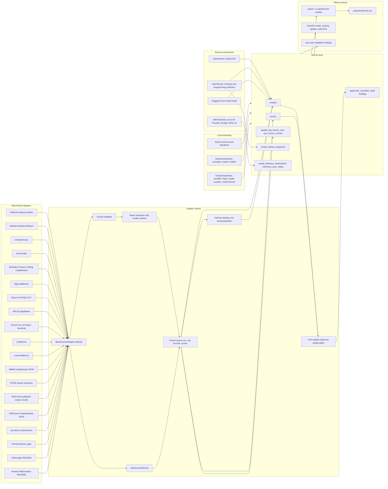

# Data Ingest Source Map

This map documents the current ingest pipeline, source inventory, and completed
source-review outcomes for the benchmark catalog. It reflects the integrated
2026-07-01 data-ingest work: backlog items `LBM-016` through `LBM-032` are now
implemented, including model-role separation for generator, embedding, and
reranker model rankings.

## Current Flow

## Update Sequence

1. `python -m backend bootstrap` is local-only. It creates or repairs the
   SQLite schema, seeds benchmark/provider/model reference rows, applies tracked
   baselines, recovers interrupted updates, and refreshes local identity state.
2. `python -m backend update` selects adapters, creates an `update_log`, and
   runs each adapter through `fetch_raw()` and `normalize()`.
3. Each adapter produces raw source records and normalized score candidates.
   The update engine resolves names, creates missing models, promotes trusted
   metadata through explicit precedence rules, upserts the best score per model
   and benchmark, and stores raw records for auditability.
4. Post-source phases refresh identity/canonical model fields, reapply provider
   origin baselines, pull OpenRouter model metadata, refresh Hugging Face model
   cards and licenses, collect optional OpenRouter market signals, and run the
   post-update audit.
5. `python -m backend inference-sync` is a separate sync for hyperscaler
   inference destinations. It writes availability, region, deployment-mode, and
   pricing evidence to the inference catalog tables.

## Current Source Inventory

| Source | Current adapter or phase | Provides now | Caveats or next step |
| --- | --- | --- | --- |
| Artificial Analysis models | `ArtificialAnalysisAdapter` | Intelligence, speed, blended cost, creator/family metadata. | General model leaderboard only; additional AA evaluation pages should be added as separate adapters when stable. |
| Artificial Analysis IFBench | `ArtificialAnalysisIfbenchAdapter` | IFBench score plus cost, output-token, and latency metrics. | One AA evaluation page is integrated; other AA pages remain future candidates. |
| Chatbot Arena | `ChatbotArenaAdapter` | Arena ELO, rank bands, votes, organization, model URL, license, price, context metadata. | Metadata promotion uses source-precedence rules and does not override higher-trust sources silently. |
| AILuminate | `AILuminateAdapter` | Public grade plus locale and system-class companion evidence. | Risk-category detail should wait for a stable detail-page surface. |
| Berkeley Function Calling Leaderboard | `BfclAdapter` | Overall function-calling accuracy, component scores, cost, latency, organization, license, evaluation mode. | Current catalog score is overall BFCL; component scores remain raw metadata. |
| BigCodeBench | `BigCodeBenchAdapter` | Full/Hard aggregate plus Instruct/Complete Pass@1 variants. | Variant scores stay separate to avoid one opaque coding score. |
| Epoch AI GPQA CSV | `EpochGpqaAdapter` | GPQA Diamond score, task version, organization, stderr, status from `benchmarks.csv`. | Filters the shared CSV down to GPQA Diamond only. |
| HELM Capabilities | `HelmCapabilitiesAdapter` | Core-scenarios mean plus MMLU-Pro, GPQA, IFEval, WildBench, and Omni-MATH component scores with release metadata. | Use as transparent triangulation; HELM freshness is lower than sources with active current releases. |
| IFEval | `IfevalAdapter` | Instruction-following score, rank, organization, verified/self-reported flags, provider/model IDs, price, context, announcement date, latency, throughput. | Dominated by self-reported/unverified data; trust labels and precedence rules matter. |
| LiveBench | `LiveBenchAdapter` | Official static leaderboard overall and category scores with release and task-score metadata. | Task-level LiveBench scores remain raw metadata until category ingestion is stable in production. |
| LiveCodeBench | `LiveCodeBenchAdapter` | Code-generation Pass@1 for the default window plus difficulty, platform, release-window, and contamination metadata. | Contamination flags should be inspected before using the score as a sole coding signal. |
| MMMU | `MmmuAdapter` | Validation overall plus stable test and MMMU-Pro companion metrics; human/random baselines are skipped. | Use validation overall as the continuity anchor; companion rows add coverage. |
| MTEB | `MtebAdapter` | Retrieval, reranking, and blended retrieval/reranking averages from official per-task result files, with task, revision, language, and role metadata. The adapter scans every model directory in upstream `paths.json` and samples task files per model instead of capping the source by model order. | Used only for embedding/reranker model-role rankings; generator use cases remain separated. |
| RAGTruth | `RagtruthAdapter` | Overall and task-level hallucination rates for published held-out corpus evidence. | Historical corpus evidence; lower is better. |
| SWE-bench | `SwebenchAdapter` | Verified best single-model submission plus Lite, Full, Multilingual, and Multimodal companion split scores; submitter/scaffold metadata is preserved. | Harness and scaffold effects still require review when interpreting scores. |
| tau-bench | `TaubenchAdapter` | Standard text and voice domain Pass^1 scores with domain, mode, retrieval, and submission metadata. | Custom or aggregate systems are skipped for model score rows. |
| Terminal-Bench | `TerminalBenchAdapter` | Best verified single-model Terminal-Bench score plus agent, version, integration method, date, and stderr metadata. | Phase-two only; distinguish model capability from best agent-system evidence. |
| FaithJudge | `FaithJudgeAdapter` | Aggregate RAG hallucination rate plus task-level FaithBench/RAGTruth summarization, QA, and data-to-text rates. | Lower is better; task rows prevent one aggregate from carrying all RAG faithfulness meaning. |
| Vectara Hallucination | `VectaraHallucinationAdapter` | Factual consistency plus hallucination-rate and answer-rate companion metrics. | This is grounded summarization evidence, not retrieval relevance. |
| OpenRouter models | `_refresh_openrouter_model_metadata()` | Model IDs/slugs, canonical OpenRouter identity, context and pricing fields, Hugging Face repo links, newly discovered provisional models. | Not first-party truth for every vendor; source precedence prevents silent overrides. |
| OpenRouter market | `_refresh_openrouter_market_signals()` | Global and programming rank, total tokens, share, change ratio, request count, volume snapshots. | Ranking page payloads are optional and can change shape; failures are nonfatal warnings and appear in freshness/degraded export context. |
| Hugging Face model cards | `_refresh_model_card_metadata()` | Model-card URL/source, docs/repo/paper URLs, license, base models, languages, capabilities, intended use, limitations, training data, cutoff. | Only models with `huggingface_repo_id`; README extraction can be incomplete or noisy. |
| Hyperscaler catalogs | `sync_inference_catalog()` | AWS Bedrock, Azure AI Foundry, and Google Vertex AI availability, regions, deployment modes, pricing, source links, sync status. | AWS/GCP richer catalog data needs credentials; Azure public pricing can rate-limit. |
| Repo baselines | `provider_origin_baseline.json`, `model_curation_baseline.json`, `model_license_baseline.json` | Durable manual provider origin, family/canonical curation, exact/family/provider license policy. | Manual and only refreshed when exported. |

## Implemented Source-Review Outcomes

### Existing-source Wins

- `LBM-016`: adapter-fetched metadata promotion now uses explicit source
  precedence and preserves raw evidence.
- `LBM-017`: Vectara now emits hallucination-rate and answer-rate companion
  metrics.
- `LBM-018`: FaithJudge now emits task-level hallucination metrics for
  summarization, QA, and data-to-text.
- `LBM-019`: MMMU now preserves stable test and MMMU-Pro companion metrics.
- `LBM-020`: Terminal-Bench now preserves agent and harness evidence in raw
  records and notes.
- `LBM-021`: AILuminate now keeps locale and system-class evidence.
- `LBM-022`: Artificial Analysis now includes the IFBench evaluation page.
- `LBM-023`: SWE-bench now imports Lite, Full, Multilingual, and Multimodal
  companion splits.
- `LBM-024`: model exports now expose source freshness and degraded-source
  context.

### New Source Adapters

- `LBM-025`: `LiveBenchAdapter`
- `LBM-026`: `BfclAdapter`
- `LBM-027`: `LiveCodeBenchAdapter`
- `LBM-028`: `BigCodeBenchAdapter`
- `LBM-029`: `HelmCapabilitiesAdapter`
- `LBM-030`: `TaubenchAdapter`
- `LBM-031`: `RagtruthAdapter`
- `LBM-032`: `MtebAdapter` with embedding/reranker model-role separation

### Model-role Boundary

MTEB retrieval and reranking scores are intentionally isolated from generator
model rankings. The `models.model_roles_json` schema field and serialized
`model_roles` API/export field distinguish `generator`, `embedding`,
`reranker`, and future `multimodal_embedding` roles. Generator use cases default
to `["generator"]`; the new `retrieval_embeddings` and `retrieval_reranking`
use cases rank only embedding or reranker models. MTEB model coverage is not
limited by upstream `paths.json` ordering, so later-listed providers such as
OpenAI embeddings remain eligible for import.

## Source Evidence Checked

- LiveBench documents contamination-resistant monthly/newer questions, objective
  ground-truth scoring, 18 tasks across 6 categories, and Hugging Face data
  downloads: <https://github.com/livebench/livebench>
- Artificial Analysis evaluation pages expose IFBench, LiveCodeBench details,
  token usage/cost panels, and links to other evaluation leaderboards:
  <https://artificialanalysis.ai/evaluations/ifbench>
- BFCL describes an executable function-calling evaluation and states that
  leaderboard statistics/data are Apache 2.0:
  <https://github.com/ShishirPatil/gorilla/tree/main/berkeley-function-call-leaderboard>
- BigCodeBench documents Hard/Full and Complete/Instruct variants for practical
  programming tasks: <https://bigcode-bench.github.io/>
- HELM documents transparent/reproducible leaderboards, capability/safety/VHELM
  surfaces, and maintenance mode as of 2026-06-01:
  <https://github.com/stanford-crfm/helm>
- tau2/tau3-bench documents domain policies, tools, task sets, airline/retail/
  telecom/banking knowledge domains, and text/voice evaluation modes:
  <https://github.com/sierra-research/tau2-bench>
- RAGTruth documents word-level hallucination data for RAG with QA,
  data-to-text, and summarization fields:
  <https://github.com/ParticleMedia/RAGTruth>
- MTEB documents an embedding/retrieval evaluation toolbox and leaderboard:
  <https://github.com/embeddings-benchmark/mteb/>
- MTEB publishes official leaderboard result data in the
  `embeddings-benchmark/results` repository:
  <https://github.com/embeddings-benchmark/results>
