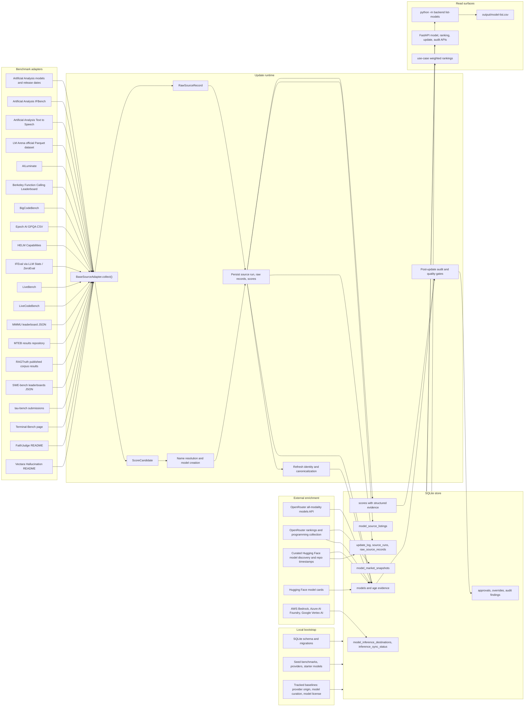

# Data Ingest Source Map

This map documents the current ingest pipeline, source inventory, and completed
source-review outcomes for the benchmark catalog. It reflects the integrated
2026-07-01 data-ingest work: backlog items `LBM-016` through `LBM-032` are now
implemented, including model-role separation for generator, embedding,
reranker, speech-to-text, and text-to-speech model rankings. It also documents
the curated model-discovery lane that exposes official small-model candidates
and provider catalog rows even when ranking evidence is not available yet, plus
the `LBM-036` release-age evidence fields.

## Current Flow

## Update Sequence

1. `python -m backend bootstrap` is local-only. It creates or repairs the
   SQLite schema, seeds benchmark/provider/model reference rows, applies tracked
   baselines, canonicalizes provider aliases, recovers interrupted updates, and
   refreshes local identity state.
2. `python -m backend update` selects adapters, creates an `update_log`, and
   runs each adapter through `fetch_raw()` and `normalize()`.
3. Each adapter produces raw source records and normalized score candidates.
   The update engine resolves names, creates missing models, promotes trusted
   metadata through explicit precedence rules, upserts the best score per model
   and benchmark, and stores raw records for auditability. Trusted source
   release dates are promoted with precision, confidence, source URL, and
   verification timestamp.
4. Post-source phases refresh identity/canonical model fields, reapply provider
   origin baselines, pull all-modality OpenRouter model metadata, run configured
   model discovery for full updates, refresh Hugging Face model cards and
   licenses, collect optional OpenRouter market signals, and run the
   post-update audit. Benchmark-scoped updates skip model discovery unless
   `--refresh-model-discovery` is passed. Hugging Face repository creation,
   OpenRouter addition, provider-catalog inclusion, and local discovery
   timestamps are retained as age proxies, not as official release dates.
5. `python -m backend inference-sync` is a separate sync for hyperscaler
   inference destinations. It writes availability, region, deployment-mode, and
   pricing evidence to the inference catalog tables.

The review catalog reports ingestion freshness without treating API response
generation as a sync. `generated_at` remains the response-build timestamp;
`database_updated_at` is derived read-only from the newest SQLite database or
WAL file modification time, while `last_sync_at`, `last_sync_status`, and
`last_sync_log_id` come from the newest `update_log` row ordered by start time
and id. Running updates use their start time; terminal updates use their
completion time.

## Current Source Inventory

| Source | Current adapter or phase | Provides now | Caveats or next step |
| --- | --- | --- | --- |
| Artificial Analysis models | `ArtificialAnalysisAdapter` | Intelligence, speed, blended cost, creator/family metadata, release date. | Release dates are promoted as high-confidence model release evidence; additional AA evaluation pages should be added as separate adapters when stable. |
| Artificial Analysis IFBench | `ArtificialAnalysisIfbenchAdapter` | IFBench score plus cost, output-token, and latency metrics. | One AA evaluation page is integrated; other AA pages remain future candidates. |
| Artificial Analysis Text to Speech | `ArtificialAnalysisTtsAdapter` | Text-to-speech Speech Arena Elo, generation time, price per 1M characters, open-weight flags, provider/model metadata, and source links. | Used only for `text_to_speech` rankings; individual voices remain metadata unless exposed as distinct provider endpoints. |
| LM Arena | `ChatbotArenaAdapter` | Official revision-pinned Parquet snapshots for raw Text Overall, style-controlled Text Overall and selected categories, WebDev, Agent IPS success, style-controlled Vision, Document, and Search. Persists confidence bounds, variance, votes/observations/sessions, rank, category, publication date, methodology, style-control flag, revision metadata, and listing lifecycle evidence. | Resolves the dataset HEAD SHA once per run and uses immutable URLs for every subset. The official Parquet schema does not expose preliminary status, so that generic evidence field remains unknown unless an authoritative source supplies it. The legacy `chatbot_arena` ID is style-controlled Text Overall. New signals are unweighted by default. Dataset identities never create, reactivate, deactivate, or deprecate catalog models; unmatched listings remain queryable evidence. Rendered-page parsing and its unsafe fallback were removed. |

### LM Arena contract

The adapter validates HTTP success, Parquet readability, required columns,
latest publication dates, required Overall categories, bounded identities,
finite scores, and coherent confidence intervals before returning any records.
Optional selected Text categories may be absent without failing unrelated Arena
surfaces. Duplicate display names in an official category are collapsed
deterministically to the row with the largest vote/session/observation count and
the duplicate count is retained in source metadata.

`scores` stores generic structured evidence (`confidence_lower`,
`confidence_upper`, `variance`, count fields, rank, category, publication date,
methodology, style control, optional preliminary status, listing status, and source
metadata). `model_source_listings` separately upserts first/last-seen lifecycle
evidence, including unmatched identities, without treating Arena presence as
global provider availability. After a complete validated snapshot, previously
listed keys absent from that benchmark are marked `no_longer_listed` while
their last-seen timestamp is preserved; this neutral evidence never changes a
model's global catalog status. The model API exposes matched listing evidence;
CSV bundles include `scores` and `source-listings` companion files.
Arena leaves `preliminary` null because its official Parquet schema does not
publish that field; the generic column remains available for authoritative
sources that do.

The post-update audit requires at least 5% of Arena listing rows, and at least
two rows for small runs, to resolve to known catalog models. This is below the
current live resolution ratio while ensuring a severe non-zero identity
collapse cannot pass merely because a handful of names still match.
| AILuminate | `AILuminateAdapter` | Public grade plus locale and system-class companion evidence. | Risk-category detail should wait for a stable detail-page surface. |
| Berkeley Function Calling Leaderboard | `BfclAdapter` | Overall function-calling accuracy, component scores, cost, latency, organization, license, evaluation mode. | Current catalog score is overall BFCL; component scores remain raw metadata. |
| BigCodeBench | `BigCodeBenchAdapter` | Full/Hard aggregate plus Instruct/Complete Pass@1 variants. | Variant scores stay separate to avoid one opaque coding score. |
| Epoch AI GPQA CSV | `EpochGpqaAdapter` | GPQA Diamond score, task version, organization, stderr, status from `benchmarks.csv`. | Filters the shared CSV down to GPQA Diamond only. |
| HELM Capabilities | `HelmCapabilitiesAdapter` | Core-scenarios mean plus MMLU-Pro, GPQA, IFEval, WildBench, and Omni-MATH component scores with release metadata. | Use as transparent triangulation; HELM freshness is lower than sources with active current releases. |
| IFEval | `IfevalAdapter` | Instruction-following score, rank, organization, verified/self-reported flags, provider/model IDs, price, context, announcement date, latency, throughput. | Announcement dates are lower-confidence release evidence when the source is self-reported; trust labels and precedence rules matter. |
| LiveBench | `LiveBenchAdapter` | Official static leaderboard overall and category scores with release and task-score metadata. | Task-level LiveBench scores remain raw metadata until category ingestion is stable in production. |
| LiveCodeBench | `LiveCodeBenchAdapter` | Code-generation Pass@1 for the default window plus difficulty, platform, release-window, and contamination metadata. | Contamination flags should be inspected before using the score as a sole coding signal. |
| MMMU | `MmmuAdapter` | Validation overall plus stable test and MMMU-Pro companion metrics; human/random baselines are skipped. | Use validation overall as the continuity anchor; companion rows add coverage. |
| MTEB | `MtebAdapter` | Retrieval, reranking, blended retrieval/reranking, and RTEB Finance averages from official per-task result files plus the official `mteb/results` dataset, with task, revision, language, public/private, and role metadata. | Used only for embedding/reranker model-role rankings; generator use cases remain separated. RTEB Finance is a finance-domain retrieval signal, not a generator answer-quality score. |
| Open ASR Leaderboard | `OpenAsrLeaderboardAdapter` | English short-form, multilingual, and long-form word error rate plus RTFx speed from the Hugging Face Open ASR Leaderboard CSV datasets. | Used only for `speech_to_text` model-role rankings; WER is lower-is-better quality evidence, while RTFx is companion speed evidence. |
| RAGTruth | `RagtruthAdapter` | Overall and task-level hallucination rates for published held-out corpus evidence. | Historical corpus evidence; lower is better. |
| SWE-bench | `SwebenchAdapter` | Verified best single-model submission plus Lite, Full, Multilingual, and Multimodal companion split scores; submitter/scaffold metadata is preserved. | Harness and scaffold effects still require review when interpreting scores. |
| tau-bench | `TaubenchAdapter` | Standard text and voice domain Pass^1 scores with domain, mode, retrieval, and submission metadata. | Custom or aggregate systems are skipped for model score rows. |
| Terminal-Bench | `TerminalBenchAdapter` | Best verified single-model Terminal-Bench score plus agent, version, integration method, date, and stderr metadata. | Phase-two only; distinguish model capability from best agent-system evidence. |
| FaithJudge | `FaithJudgeAdapter` | Aggregate RAG hallucination rate plus task-level FaithBench/RAGTruth summarization, QA, and data-to-text rates. | Lower is better; task rows prevent one aggregate from carrying all RAG faithfulness meaning. |
| Vectara Hallucination | `VectaraHallucinationAdapter` | Factual consistency plus hallucination-rate and answer-rate companion metrics. | This is grounded summarization evidence, not retrieval relevance. |
| OpenRouter models | `_refresh_openrouter_model_metadata()` | All output modalities, model IDs/slugs, canonical OpenRouter identity, context and pricing fields, Hugging Face repo links, OpenRouter addition timestamp, newly discovered provisional models. | OpenRouter addition is an age proxy, not an official release date; source precedence prevents silent overrides. |
| Configured model discovery | `_refresh_configured_model_discovery()` | Static provider catalog rows plus curated official/provider-owned Hugging Face repos and authenticated provider API catalogs, model roles, `huggingface_repo_id`, model-card/docs links, creation and modification timestamps, model size fields, context/output limits, pricing where exposed, small-model candidate flag, provisional or tracked catalog rows, and raw source records. | Metadata-only discovery does not synthesize scores or relax ranking gates. The baseline covers small generator families including Google Gemma, Microsoft Phi, Meta Llama 3.2 small models, Qwen small models, Mistral/Ministral small models, and IBM Granite generators; NVIDIA retrieval/NIM, IBM watsonx Slate, and IBM Granite retrieval entries; provider/open-weight text-to-speech entries from OpenAI, Google, ElevenLabs, Cartesia, Deepgram, Amazon Polly, Azure Speech, PlayHT, Resemble, and Kokoro; official OpenAI GPT-5.6 Sol, Terra, and Luna catalog rows; and restricted-access frontier/cyber rows such as Claude Mythos 5 and GPT-5.5-Cyber when official provider documentation exists, while excluding community quantizations/fine-tunes unless a trusted mirror is configured. Provider API discovery supports OpenAI, Anthropic, Google Gemini, Mistral, Cohere, and xAI when their environment keys are present; missing keys are recorded as skipped source runs. |
| OpenRouter market | `_refresh_openrouter_market_signals()` | Global and programming rank, total tokens, share, change ratio, request count, volume snapshots. | Ranking page payloads are optional and can change shape; failures are nonfatal warnings and appear in freshness/degraded export context. |
| Hugging Face model cards | `_refresh_model_card_metadata()` | Model-card URL/source, docs/repo/paper URLs, license, base models, languages, capabilities, intended use, limitations, training data, cutoff. | Only models with `huggingface_repo_id`; README extraction can be incomplete or noisy. |
| Hyperscaler catalogs | `sync_inference_catalog()` | AWS Bedrock, Azure AI Foundry, and Google Vertex AI availability, regions, deployment modes, pricing, source links, sync status. | AWS/GCP richer catalog data needs credentials; Azure public pricing can rate-limit. |
| Repo baselines | `provider_origin_baseline.json`, `model_curation_baseline.json`, `model_license_baseline.json` | Durable manual provider origin, family/canonical curation, exact/family/provider license policy. Provider aliases such as Amazon Nova/AWS/Bedrock, Azure/Microsoft Azure/Azure AI Foundry, Qwen/Alibaba, Mistral/Mistral AI, and ibm-granite/IBM collapse to their parent provider rows. | Manual and only refreshed when exported. |

## Implemented Source-Review Outcomes

### Existing-source Wins

- `LBM-016`: adapter-fetched metadata promotion now uses explicit source
  precedence and preserves raw evidence.
- `LBM-017`: Vectara now emits hallucination-rate and answer-rate companion
  metrics.
- `LBM-018`: FaithJudge now emits task-level hallucination metrics for
  summarization, QA, and data-to-text.
- `LBM-019`: MMMU now preserves stable test and MMMU-Pro companion metrics.
- `LBM-020`: Terminal-Bench now preserves agent and harness evidence in raw
  records and notes.
- `LBM-021`: AILuminate now keeps locale and system-class evidence.
- `LBM-022`: Artificial Analysis now includes the IFBench evaluation page.
- `LBM-023`: SWE-bench now imports Lite, Full, Multilingual, and Multimodal
  companion splits.
- `LBM-024`: model exports now expose source freshness and degraded-source
  context.
- `LBM-036`: model exports now expose release-date provenance, model-age
  estimates, Hugging Face repository timestamps, and all-modality OpenRouter
  discovery coverage.
- `LBM-061`: text-to-speech coverage now has a dedicated model role, Artificial
  Analysis TTS adapter, provider catalog seeds, and role-specific ranking lane.
- `LBM-062`: restricted-access frontier/cyber models such as Claude Mythos 5 and
  GPT-5.5-Cyber now have official provider catalog rows.

### New Source Adapters

- `LBM-025`: `LiveBenchAdapter`
- `LBM-026`: `BfclAdapter`
- `LBM-027`: `LiveCodeBenchAdapter`
- `LBM-028`: `BigCodeBenchAdapter`
- `LBM-029`: `HelmCapabilitiesAdapter`
- `LBM-030`: `TaubenchAdapter`
- `LBM-031`: `RagtruthAdapter`
- `LBM-032`: `MtebAdapter` with embedding/reranker model-role separation

### Model-role Boundary

MTEB retrieval and reranking scores are intentionally isolated from generator
model rankings. The `models.model_roles_json` schema field and serialized
`model_roles` API/export field distinguish `generator`, `embedding`,
`reranker`, `multimodal_embedding`, `speech_to_text`, and `text_to_speech`
roles. Generator use cases default to `["generator"]`; `retrieval_embeddings`
and `retrieval_reranking` rank only embedding or reranker models, while
`voice_to_text` ranks only speech-to-text models and `text_to_speech` ranks
only speech-synthesis models. tau-bench voice rows remain voice-agent evidence,
not primary text-to-speech synthesis quality.

### Catalog Discovery Boundary

Configured model discovery is a catalog visibility lane, not a ranking shortcut.
It imports static provider catalog rows and official/provider-owned Hugging Face
repos from `backend/model_discovery_baseline.json`, creates active model rows,
stores raw source records, links `huggingface_repo_id` where available, records
model roles such as `embedding`, `reranker`, and `multimodal_embedding`, and
parses size markers such as `270M`, `12B`, `26B-A4B`, `E2B`, and `E4B`. The
same lane now carries selected provider text-to-speech catalog rows,
open-weight Hugging Face TTS repos, and restricted-access frontier/cyber rows
when official provider documentation exists. The exported fields let downstream
review find provider-hosted retrieval models, TTS synthesis models, restricted
trusted-access models, and small-model candidates, while rankings still require
the configured benchmark evidence for the selected use case.

### Release-age Boundary

The catalog separates official or source-asserted release dates from proxy age
signals. `release_date` is populated only from trusted source metadata such as
Artificial Analysis release dates or IFEval announcement dates, and is paired
with precision, confidence, source URL, and verification timestamp. Computed
`model_age_days` prefers exact day-level release dates, then falls back to
Hugging Face repository creation, OpenRouter addition, and local discovery
timestamps. The fallback basis and confidence are exported so spreadsheet and
API consumers can distinguish "known release date" from "best available age
proxy."

## Source Evidence Checked

- LiveBench documents contamination-resistant monthly/newer questions, objective
  ground-truth scoring, 18 tasks across 6 categories, and Hugging Face data
  downloads: <https://github.com/livebench/livebench>
- Artificial Analysis evaluation pages expose IFBench, LiveCodeBench details,
  token usage/cost panels, and links to other evaluation leaderboards:
  <https://artificialanalysis.ai/evaluations/ifbench>
- Artificial Analysis Text to Speech publishes selected-voice Speech Arena Elo
  leaders and model-level datasets for quality, price per 1M characters, and
  generation speed:
  <https://artificialanalysis.ai/text-to-speech/leaderboard/selected-voice>
  and <https://artificialanalysis.ai/text-to-speech/models>
- BFCL describes an executable function-calling evaluation and states that
  leaderboard statistics/data are Apache 2.0:
  <https://github.com/ShishirPatil/gorilla/tree/main/berkeley-function-call-leaderboard>
- BigCodeBench documents Hard/Full and Complete/Instruct variants for practical
  programming tasks: <https://bigcode-bench.github.io/>
- HELM documents transparent/reproducible leaderboards, capability/safety/VHELM
  surfaces, and maintenance mode as of 2026-06-01:
  <https://github.com/stanford-crfm/helm>
- tau2/tau3-bench documents domain policies, tools, task sets, airline/retail/
  telecom/banking knowledge domains, and text/voice evaluation modes:
  <https://github.com/sierra-research/tau2-bench>
- RAGTruth documents word-level hallucination data for RAG with QA,
  data-to-text, and summarization fields:
  <https://github.com/ParticleMedia/RAGTruth>
- MTEB documents an embedding/retrieval evaluation toolbox and leaderboard:
  <https://github.com/embeddings-benchmark/mteb/>
- MTEB publishes official leaderboard result data in the
  `embeddings-benchmark/results` repository:
  <https://github.com/embeddings-benchmark/results>
