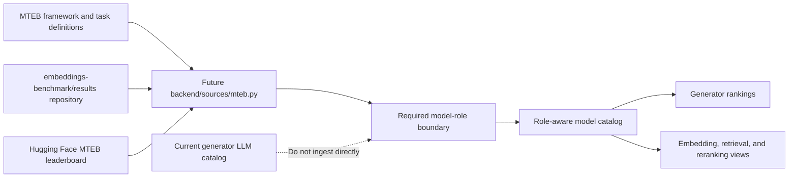

# Data Ingest Source Map

This page records source-level ingest decisions that affect the benchmark
catalog contract. It currently captures the MTEB decision because MTEB is a real
source candidate but does not fit the current generator-model ranking schema.

## Conditional Source: MTEB

MTEB is useful, but it is not a straight drop-in adapter for the current score
pipeline. The official MTEB surfaces are focused on embeddings, retrieval
systems, reranking, classification, clustering, semantic textual similarity,
and multimodal embedding tasks. The current repository stores and ranks public
scores as generative LLM benchmark evidence. Without an explicit model-role
field, MTEB rows would make generator rankings compare chat/completion models
against embedding and reranker models.

## What The Source Provides

| Surface | Provides | Adapter use |
| --- | --- | --- |
| `embeddings-benchmark/results` | Public result files indexed by `paths.json`, grouped by model and task result JSON. | Primary machine-readable source for a future adapter. |
| MTEB Hugging Face leaderboard | Interactive current leaderboard for embedding models. | Human/source verification and parity checks. |
| `embeddings-benchmark/mteb` | Evaluation framework, model definitions, task definitions, benchmark selection, and submission workflow. | Task taxonomy, benchmark naming, and result interpretation. |
| Hugging Face `mteb` organization | Project overview and linked spaces/collections. | Discovery and source ownership evidence. |

## Adapter Gate

Do not add `backend/sources/mteb.py` until the repository can represent model
roles separately from the existing `models.type` open/proprietary distinction.
The minimum prerequisite is a schema and export contract that can distinguish:

- `generator`
- `embedding`
- `reranker`
- `multimodal_embedding`

A future MTEB adapter should then import official result JSON from
`embeddings-benchmark/results`, preserve task/language/revision metadata, and
keep generator rankings role-filtered by default. The backlog row for this
work is `LBM-032`.

## Sources Checked

- MTEB framework: <https://github.com/embeddings-benchmark/mteb/>
- MTEB result data: <https://github.com/embeddings-benchmark/results>
- MTEB result index: <https://raw.githubusercontent.com/embeddings-benchmark/results/main/paths.json>
- MTEB leaderboard: <https://huggingface.co/spaces/mteb/leaderboard>
- Hugging Face MTEB organization: <https://huggingface.co/mteb>
